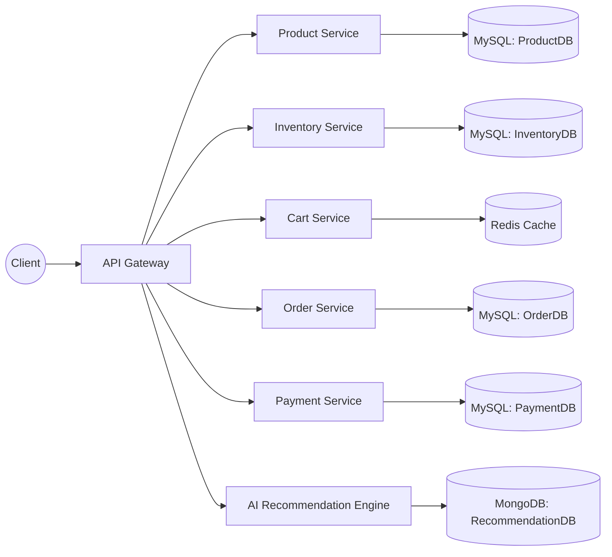

# 🏬 Retail Store Microservice Platform

A **cloud-native, microservices-driven retail platform** built with **Java (Spring Boot)**, **Docker**, **Kubernetes**, and **AI-powered Recommendation Engine**.  
This system demonstrates **real-world enterprise architecture** with modular services, centralized configuration, service discovery, API gateway, and fault-tolerant design.

---

## 🚀 Features
- **Customer-friendly shopping experience** with Cart, Order, and Payment microservices.  
- **Product & Inventory management** for real-time stock updates.  
- **AI Recommendation Engine** for personalized product suggestions.  
- **Microservice-based modular design** enabling independent scaling & deployment.  
- **Cloud-ready architecture** with Kubernetes orchestration.  

---

## 🛠️ Tech Stack
- **Backend:** Java, Spring Boot (REST APIs, JPA/Hibernate)  
- **Frontend (optional):** React.js / Vue.js  
- **Database:** MySQL (Product, Inventory, Order, Payment), Redis (Caching), MongoDB (Recommendation Engine)  
- **AI/ML:** Recommendation engine using collaborative filtering & content-based models  
- **Infrastructure:** Docker, Kubernetes, Spring Cloud (Config, Eureka, Gateway), CI/CD pipeline  

---

## 🧩 Microservices
1. **Product Service** – manages product catalog (CRUD, categories, search).  
2. **Inventory Service** – manages stock availability in real-time.  
3. **Cart Service** – handles customer shopping cart operations.  
4. **Order Service** – processes orders, communicates with Payment & Inventory.  
5. **Payment Service** – integrates with payment gateways, ensures secure transactions.  
6. **AI Recommendation Service** – provides personalized product recommendations using ML models.  

---

## 🏗️ High-Level Architecture

---

## 📦 UML Class Diagram

---

## 🔄 Sequence Diagram (Checkout Flow)

---

## 🏃 Activity Diagram (User Shopping Flow)

---

☸️ Deployment

Each service is containerized using Docker.

Kubernetes manages deployments with centralized configs.

API Gateway (Spring Cloud Gateway) routes requests.

Eureka handles service discovery.

CI/CD pipeline automates build & deployment.

---

📌 Future Enhancements

Add event-driven architecture with Kafka for async communication.

Extend AI Recommendation Engine with deep learning models.

Implement observability stack (Prometheus, Grafana, ELK).

---

👨‍💻 Author

Shahed Nur
Full-Stack Microservices Engineer | Cloud-Native Backend | AI-Powered Applications